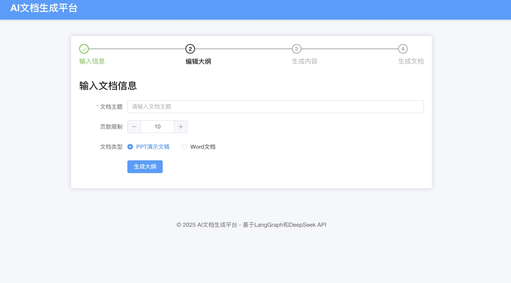

# AI文档生成平台

基于LangGraph工作流驱动的智能文档生成平台，自动生成高质量的PPT和Word文档。

## 技术架构

- 后端：FastAPI
- 工作流引擎：LangGraph (基于LangChain)
- 文档生成：python-docx, python-pptx
- 前端：Vue.js (位于frontend目录)

## LangGraph工作流实现

本项目完全基于LangGraph构建AI工作流，实现了高度模块化和可配置的文档生成流程。

### 工作流节点

工作流由以下核心节点组成：

1. `generate_title`: 根据主题生成文档标题
2. `generate_outline`: 根据标题和主题生成结构化大纲
3. `generate_content`: 根据大纲生成各章节详细内容

每个节点专注于单一职责，可以独立运行或作为工作流的一部分。

### 工作流管理

LangGraph工作流支持以下功能：

- **动态入口点**: 可以从任意节点开始执行，适用于编辑后重新生成内容
- **状态管理**: 工作流维护DocumentState对象，保存生成过程中的所有信息
- **错误处理**: 节点内置异常处理，确保工作流不会完全失败
- **可配置性**: 支持运行时配置，如入口点选择

代码示例：

```python
# 创建工作流
workflow = StateGraph(DocumentState)
workflow.add_node("generate_title", title_node)
workflow.add_node("generate_outline", outline_node)
workflow.add_node("generate_content", content_node)

# 定义节点之间的边
workflow.add_edge("generate_title", "generate_outline")
workflow.add_edge("generate_outline", "generate_content")
workflow.add_edge("generate_content", END)

# 编译工作流，支持运行时配置
compiled_workflow = workflow.compile(configurable={"entry_point": True})
```

### 使用工作流的例子

```python
# 完整工作流
result = await run_document_workflow(
    topic="人工智能在教育领域的应用",
    page_limit=15,
    document_type="ppt"
)

# 从指定阶段开始
initial_state = {
    "topic": "人工智能在医疗领域的应用",
    "title": "智能医疗：AI赋能现代医学",
    "current_step": "title_generated",
    # 其他必要参数...
}
result = await run_document_workflow(
    topic="人工智能在医疗领域的应用",
    page_limit=15,
    document_type="ppt",
    initial_state=initial_state
)
```

## API端点

平台提供以下RESTful API端点，全部基于LangGraph工作流实现：

| 端点 | 方法 | 说明 |
|------|------|------|
| `/document-workflow` | POST | 运行完整工作流，生成标题、大纲和内容 |
| `/edit-workflow-title/{request_id}` | PUT | 编辑标题 |
| `/edit-workflow-outline/{request_id}` | PUT | 编辑大纲 |
| `/regenerate-content/{request_id}` | POST | 在编辑后重新生成内容 |
| `/generate-document/{request_id}` | POST | 生成最终文档 |

### 示例请求：生成文档工作流

```json
POST /document-workflow
{
    "topic": "量化投资策略",
    "page_limit": 15,
    "document_type": "ppt"
}
```

### 示例请求：编辑大纲

```json
PUT /edit-workflow-outline/{request_id}
{
    "outline": [
        {
            "title": "量化投资概述",
            "content": ["定义与起源", "与传统投资的区别", "市场应用现状"]
        },
        {
            "title": "核心策略分析",
            "content": ["动量策略", "均值回归", "因子投资", "高频交易"]
        },
        // 更多章节...
    ]
}
```

## 环境变量配置

- `USE_LANGCHAIN`: 设置为"true"使用LangChain客户端
- `OPENAI_API_KEY`: OpenAI API密钥
- `LLM_MODEL`: 使用LangChain时的模型名称，默认为"gpt-3.5-turbo"
- `DEEPSEEK_API_KEY`: DeepSeek API密钥 (可选，优先使用LangChain)

## 快速开始

1. 安装依赖：

```bash
pip install -r requirements.txt
```

2. 配置环境变量（创建.env文件）：

```
USE_LANGCHAIN=true
OPENAI_API_KEY=your_api_key
```

3. 运行应用：

```bash
python -m app.main
```

4. 访问 http://localhost:8000

## 效果展示

### 创建文档页面



### 生成大纲页面


### 样本文档

- [word样本：量化投资：数据驱动的财富策略_58049b82](docs/量化投资：数据驱动的财富策略_58049b82.docx)
- [ppt样本： 探索强化学习的智能未来_d20456d7](docs/探索强化学习的智能未来_d20456d7.pptx)
